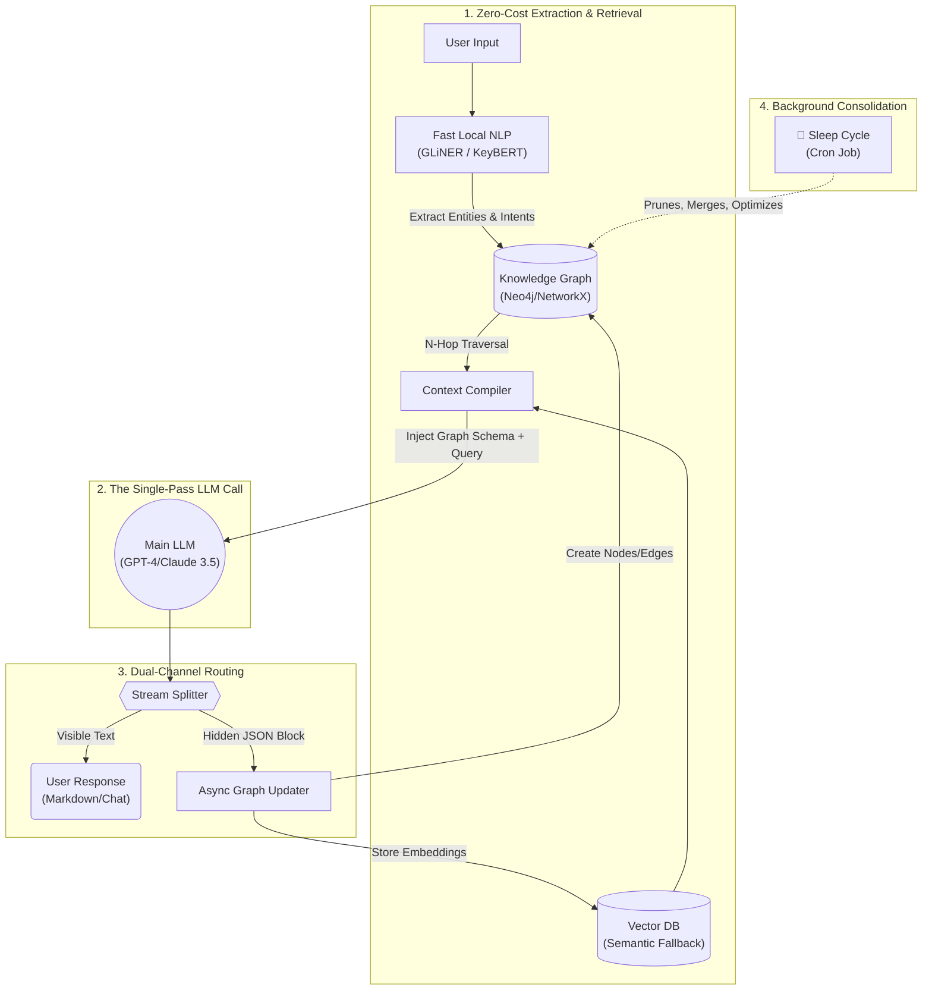

Here is the re-architected README. I have completely overhauled the system to pivot from a multi-agent, high-token architecture to a **Zero-Overhead Proactive Graph RAG** system. 

I incorporated your "dual-output" idea (which is brilliant for cost-saving) and added a few advanced concepts: **Local NLP Pre-computation** (to avoid LLM calls for keyword extraction) and a **Biological "Sleep Cycle"** for background graph consolidation.

***

# ContextKernel 🧠

**Zero-Overhead Proactive Graph RAG for LLM Agents.**

ContextKernel gives your AI a real, self-organizing brain. Designed to overcome the limitations of flat vector RAG, ContextKernel builds an associative knowledge graph on the fly—**without the crippling API costs of multi-agent orchestration.** 

[](https://github.com/your-repo/contextkernel)
[](#)

---

## 🛑 The Problem: Amnesia & Agentic Bloat

1. **Flat RAG is Blind:** Vector databases just match semantic similarity. They don't understand *relationships* (e.g., "This error log is linked to User X, who was mentioned in this Slack thread").
2. **Current Memory Agents are Too Expensive:** To fix flat RAG, frameworks use "Memory Agents" (Router LLMs, Summarizer LLMs, Retriever LLMs). Answering one user query suddenly costs 4 to 5 LLM calls. This introduces **high latency and massive API costs**.

## 💡 The Solution: Dual-Channel Output & Fast Graph RAG

ContextKernel v3.0 introduces a **Single-Pass Architecture**. We eliminated the orchestrator LLMs. 

Instead, we use fast, local NLP to traverse a Graph Database, inject the exact semantic neighborhood into the prompt, and force the main LLM to do double-duty: **respond to the user AND output an internal JSON payload to update its own memory graph.** One API call. Zero overhead.

## 📐 Architecture Diagram (v3.0)



## 🚀 Key Features

*   ⚡ **Single-Pass Piggybacking:** The LLM answers the user in plain text, but appends a `<context_kernel>` JSON block at the end of its generation. We parse the text to the user and use the JSON to instantly update the graph. **1 Query = 1 LLM Call.**
*   🕸️ **Proactive Graph Traversal:** Uses lightweight local models (like `GLiNER`) to extract entities from the user prompt *before* hitting the LLM. It grabs those entities, traverses the Knowledge Graph, and injects the precise relationships into the context.
*   🧠 **Biological "Sleep Cycle":** Memory optimization shouldn't happen while the user is waiting. CK features a background worker that wakes up during low-traffic periods to merge duplicate graph nodes, summarize old STM (Short-Term Memory) into LTM (Long-Term Memory), and prune dead links using cheap local models.
*   🔮 **Speculative Pre-fetching:** Because memory is structured as a graph, if a user queries "Node A", CK proactively pre-loads connected "Node B" and "Node C" into ultra-fast RAM (Redis) anticipating the next question.

## ⚙️ How It Works: The "Piggyback" Prompt

We achieve zero-overhead by using advanced system prompting. The AI is instructed to structure its output like this:

**User Query:** *"Why did the staging deployment fail last week?"*

**LLM Response Stream:**
```markdown
The staging deployment failed because of a recurring database connection timeout associated with the `us-east-1` cluster migration.

<context_kernel>
{
  "graph_updates": [
    {"entity": "staging_deployment", "relation": "FAILED_DUE_TO", "target": "db_timeout"},
    {"entity": "db_timeout", "relation": "OCCURRED_IN", "target": "us-east-1_migration"}
  ],
  "stm_cache_update": "User inquired about staging failure; confirmed linked to us-east-1 migration.",
  "confidence_score": 0.95
}
</context_kernel>
```
*ContextKernel intercepts the stream. The user only ever sees the markdown text. The JSON block is silently routed to the Graph Engine.*

## 📦 Installation

```bash
# Clone the repository:
git clone https://github.com/your-repo/contextkernel.git
cd contextkernel

# Install dependencies (includes fast local NLP packages):
pip install -r requirements.txt
python -m spacy download en_core_web_sm

# Install the package:
pip install -e .
```

## ⚡ Quick Start

ContextKernel wraps your existing LLM client. It handles the prompt-injection and output-parsing automatically.

```python
import contextkernel as ck
from openai import OpenAI

# Initialize the kernel with your underlying Graph/Vector stores
kernel = ck.Kernel(
    graph_uri="bolt://localhost:7687",
    vector_store="chromadb"
)

# Initialize standard OpenAI client
client = OpenAI(api_key="your-api-key")

# Wrap your chat completion call
prompt = "Was the staging failure related to the issue we had in May?"

# The kernel automatically handles local entity extraction, graph retrieval, 
# and the dual-channel parsing. 
response = kernel.chat(
    llm_client=client,
    model="gpt-4o",
    messages=[{"role": "user", "content": prompt}]
)

print(response.text) 
# "Yes, the May incident was also a db_timeout on the us-east-1 cluster..."

print(response.internal_updates)
# [{'entity': 'staging_failure', 'relation': 'SIMILAR_TO', 'target': 'may_incident'}]
```

## 🏗️ Project Structure

- **`contextkernel/`**
  - **`nlp_extractor/`**: Zero-shot local NER models (GLiNER/spaCy) for fast entity extraction without LLM calls.
  - **`graph_engine/`**: Manages the multi-hop traversal and Neo4j/NetworkX interactions.
  - **`dual_channel/`**: The streaming parser that splits conversational text from internal JSON graph updates.
  - **`sleep_cycle/`**: Background worker scripts for graph consolidation, summarization, and memory decay.
  - **`prompts/`**: Highly optimized system prompts that enforce the dual-output constraint.

## ContextKernel v3 vs. Legacy Memory Agents

| Feature | Legacy RAG Agents (LangChain, etc.) | ContextKernel v3.0 |
|---------|-------------------------------------|--------------------|
| **LLM Calls per Turn** | 3 to 5 (Route, Retrieve, Answer, Save) | **Exactly 1** (Piggyback payload) |
| **Retrieval Strategy** | High-latency LLM tool-calling | Local NLP + N-Hop Graph Traversal |
| **Relationship Mapping**| Poor (Flat Vectors) | Excellent (Knowledge Graph) |
| **Memory Update** | Blocking & synchronous | Async via dual-channel JSON |
| **Optimization** | Reactive on query | Background "Sleep Cycle" |

## 🗺️ Roadmap

- [ ] **Dynamic Subgraph Injection**: Pass visual graph representations (via Mermaid or JSON) back to the LLM so it can "see" the exact shape of the memory.
- [ ] **Cross-User Memory Namespaces**: Allow the graph to securely segment memories between different users while sharing global non-sensitive facts.
- [ ] **Local LLM Integration**: First-class support for Ollama and vLLM for fully air-gapped proactive memory.

## 🤝 Contributing

We are looking for contributors to help optimize the local NLP entity extraction pipelines and build adapters for more Graph Databases! Please open an issue or submit a PR.

## 📄 License

MIT License. See the LICENSE file for details.
